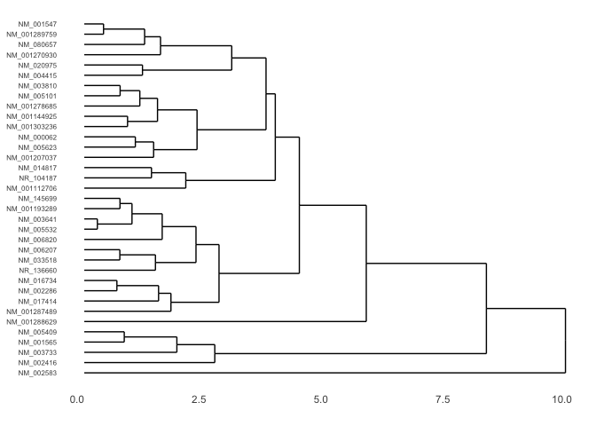

ZIKV r-log transformed data analysis
================
Joan M. Valls Cuevas
5/3/2019

Load r-log transformed data
===========================

Source: Gene mapping and Quality control performed by Aaron Carlin MD PHD

``` r
my_dat <- data.frame(read.delim("hDC_AR_rlog.txt"))

#row name set to the first column of the original dataframe

my_dat2 <- data.frame(my_dat[,9:17], row.names = my_dat[,1])

#change columns names to a more concise title
colnames(my_dat2) <- c( "hDC7_mock", "hDC7_ZIKVneg", "hDC7_ZIKVpos",
                         "hDC8_mock", "hDC8_ZIKVneg", "hDC8_ZIKVpos",
                         "hDC10_mock", "hDC10_ZIKVneg", "hDC10_ZIKVpos")
head(my_dat2)
```

    ##              hDC7_mock hDC7_ZIKVneg hDC7_ZIKVpos hDC8_mock hDC8_ZIKVneg
    ## NM_173803        0.000        0.000        0.000     0.000        0.000
    ## NM_001301039     7.898        8.195        7.793     7.982        8.107
    ## NM_014423       11.268       11.390       11.320    11.283       11.393
    ## NM_001103167     4.975        4.502        5.308     4.641        4.055
    ## NR_134623        2.225        1.677        1.903     1.936        1.799
    ## NM_001039141     8.404        8.615        8.596     8.524        8.958
    ##              hDC8_ZIKVpos hDC10_mock hDC10_ZIKVneg hDC10_ZIKVpos
    ## NM_173803           0.000      0.000         0.000         0.000
    ## NM_001301039        7.615      8.362         8.503         7.622
    ## NM_014423          11.263     11.304        11.519        11.699
    ## NM_001103167        4.989      5.293         4.337         4.810
    ## NR_134623           1.993      1.537         1.558         1.900
    ## NM_001039141        8.681      8.405         8.721         8.264

``` r
#comment
#Subtract the mock from the ZIKV negative or positive samples

sample_dat <- data.frame(my_dat2[,2:3] - my_dat2$hDC7_mock,
                         my_dat2[,5:6] - my_dat2$hDC8_mock,
                         my_dat2[,8:9] - my_dat2$hDC10_mock)
head(sample_dat)
```

    ##              hDC7_ZIKVneg hDC7_ZIKVpos hDC8_ZIKVneg hDC8_ZIKVpos
    ## NM_173803           0.000        0.000        0.000        0.000
    ## NM_001301039        0.297       -0.105        0.125       -0.367
    ## NM_014423           0.122        0.052        0.110       -0.020
    ## NM_001103167       -0.473        0.333       -0.586        0.348
    ## NR_134623          -0.548       -0.322       -0.137        0.057
    ## NM_001039141        0.211        0.192        0.434        0.157
    ##              hDC10_ZIKVneg hDC10_ZIKVpos
    ## NM_173803            0.000         0.000
    ## NM_001301039         0.141        -0.740
    ## NM_014423            0.215         0.395
    ## NM_001103167        -0.956        -0.483
    ## NR_134623            0.021         0.363
    ## NM_001039141         0.316        -0.141

PCA plot using **prcomp()**
===========================

Here we will make a PCA plot of the data and also plot the most important features of the data.

``` r
pca <- prcomp(t(sample_dat))

plot(pca$x[,1], pca$x[,2])
text(pca$x[,1], pca$x[,2], colnames(sample_dat))
```


``` r
summary(pca)
```

    ## Importance of components:
    ##                           PC1     PC2     PC3      PC4     PC5       PC6
    ## Standard deviation     41.965 27.8720 20.1202 16.17732 11.1736 1.304e-13
    ## Proportion of Variance  0.529  0.2333  0.1216  0.07861  0.0375 0.000e+00
    ## Cumulative Proportion   0.529  0.7623  0.8839  0.96250  1.0000 1.000e+00

``` r
#plot of the most important features and their variances 

load_val <- sort((abs(pca$rotation[,1])), decreasing = TRUE)

plot(load_val)
abline(h=0.013)
```


application
-----------

``` r
#This function is a filter for the data frame for all conditions in a row and a certain 
#range value
all_true_filter <- function(datframe, x) {
  all_true <- (abs(datframe$hDC7_ZIKVneg) < x & abs(datframe$hDC10_ZIKVpos) < x
               & abs(datframe$hDC8_ZIKVneg) < x & abs(datframe$hDC10_ZIKVneg) < x
               & abs(datframe$hDC7_ZIKVpos) < x & abs(datframe$hDC8_ZIKVpos) < x)
} 
#make a copy to modify the copy and keep the original

sample_dat2 <- sample_dat

#Remove all the rows when all values in that row are between a certain range

sample_dat2 <- sample_dat2[!(all_true_filter(sample_dat2, 4)),]


#Cluster the data 

sample_dat_clust2 <- hclust(dist(scale(sample_dat2)))

plot(sample_dat_clust2)
```

 Graphing up and downregulated genes on a barplot

``` r
sample_dat3 <- sample_dat2

sample_dat3 <- data.frame(sample_dat2$hDC7_ZIKVpos - sample_dat2$hDC7_ZIKVneg,
                          sample_dat2$hDC8_ZIKVpos - sample_dat2$hDC8_ZIKVneg,
                          sample_dat2$hDC10_ZIKVpos - sample_dat2$hDC10_ZIKVneg, row.names = row.names(sample_dat2))

# positive values is upregulation, negative value is downregulation
#only on the first sample hDC7

pos_count <- length(sample_dat3[sample_dat3 >0,1])

neg_count <- length(sample_dat3[sample_dat3 <0,1])


count_matrix <- c(pos_count, neg_count)
x_label <- c("Up" , "Down")
#pplot of ZIKV+ vs ZIKV-
barplot(count_matrix, 
        names.arg = x_label,
        ylab = "ZIKV+ vs. ZIKV- regulated genes")
```


Creating a heatmap + Dendrogram : Clustering
--------------------------------------------

``` r
#load necessary libraries
library("ggplot2")
```

    ## Warning: package 'ggplot2' was built under R version 3.5.2

``` r
library("ggdendro")
library("reshape2")
library("grid")

scale.sample_dat2 <- scale(sample_dat2)
matrix.sample_dat2 <- as.matrix(scale.sample_dat2)

#rownames(matrix.sample_dat2) <- row.names(sample_dat2)

sample_dat2_dendro <- as.dendrogram(hclust(d = dist(x = matrix.sample_dat2)))

dendro.plot <- ggdendrogram(data = sample_dat2_dendro, rotate = TRUE)

print(dendro.plot)
```


``` r
dendro.plot <- dendro.plot + theme(axis.text.y = element_text(size = 6))

print(dendro.plot)
```



Heatmap preparation
-------------------

Using **melt()** to prepare a heatmap

``` r
#scale the data and use melt 
#takes a dataframe and combines all conditions into one column
#matrix.sample_dat2 <- as.matrix(sample_dat2)
sample.long <- melt(scale.sample_dat2)


heatmap.plot <- ggplot(data = sample.long, aes(x = Var2, y = Var1)) +
  geom_tile(aes(fill = value)) +
  scale_fill_gradient2() +
  theme(axis.text.y = element_text(size = 6))


# Preview the heatmap
print(heatmap.plot)
```


Putting it together
-------------------

``` r
#make a new page and plot the dendrogram and heatmap in the same window

grid.newpage()
print(heatmap.plot, vp = viewport(x = 0.4, y = 0.5, width = 0.8, height = 1.0))
print(dendro.plot, vp = viewport(x = 0.90, y = 0.445, width = 0.2, height = 1.0))
```


``` r
#Matching the dendrogram to the heatmap

sample.order <- order.dendrogram(sample_dat2_dendro)

sample.long$Var1 <- factor(x = sample.long$Var1,
                           levels = row.names(sample_dat2)[sample.order],
                           ordered = TRUE)

heatmap.plot2 <- ggplot(data = sample.long, aes(x = Var2, y = Var1)) +
  geom_tile(aes(fill = value)) +
  scale_fill_gradient2() +
  theme(axis.text.y = element_text(size = 6))

print(heatmap.plot2)
```


``` r
grid.newpage()
print(heatmap.plot2, vp = viewport(x = 0.4, y = 0.5, width = 0.8, height = 1.0))
print(dendro.plot, vp = viewport(x = 0.90, y = 0.445, width = 0.2, height = 1.0))
```


``` r
#reposition the legend to improve the figure

heatmap.plot2 <- ggplot(data = sample.long, aes(x = Var2, y = Var1)) +
  geom_tile(aes(fill = value)) +
  scale_fill_gradient2() +
  theme(axis.text.y = element_text(size = 6),
        legend.position = "top")

print(heatmap.plot2)
```


The finer details
-----------------

``` r
#changing column names 

colnames(sample.long)[2:3] <- c("Sample", "log2")


#change the tips to align and remove the double name

heatmap.plot2 <- ggplot(data = sample.long, aes(x = Sample, y = Var1)) +
  geom_tile(aes(fill = log2)) +
  scale_fill_gradient2() +
  theme(axis.text.y = element_blank(),
        axis.title.y = element_blank(),
        axis.ticks.y = element_blank(),
        legend.position = "top",
        text = element_text(size = 8),
        axis.title.x = element_blank())

#text = element_text(size=20),
#axis.text.x = element_text(angle=90, hjust=1)

print(heatmap.plot2)
```


``` r
#and finally put it all together

grid.newpage()
print(heatmap.plot2, vp = viewport(x = 0.4, y = 0.54, width = 0.8, height = 1.03))
print(dendro.plot, vp = viewport(x = 0.85, y = 0.43, width = 0.2, height = 0.96))
```


Credit to Jeff oliver for his Clusters and heatmaps guide which was significant to this work.

<https://jcoliver.github.io/learn-r/008-ggplot-dendrograms-and-heatmaps.html>

``` r
txt <- row.names(sample_dat2)
write.csv(txt, file = "txt1.csv")
```
