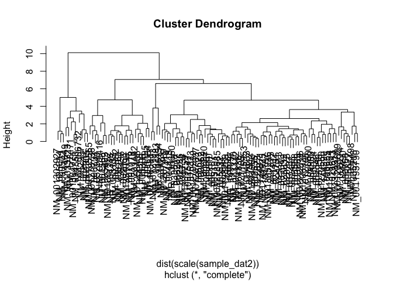

ZIKV\_Data
================
Joan M. Valls Cuevas
5/6/2019

``` r
my_dat <- data.frame(read.delim("hDC_AR_rlog.txt"))

#row name set to the first column of the original dataframe

my_dat2 <- data.frame(my_dat[,9:17], row.names = my_dat[,1])

#change columns names to a more concise title
colnames(my_dat2) <- c( "hDC7_mock", "hDC7_ZIKVneg", "hDC7_ZIKVpos",
                         "hDC8_mock", "hDC8_ZIKVneg", "hDC8_ZIKVpos",
                         "hDC10_mock", "hDC10_ZIKVneg", "hDC10_ZIKVpos")
#head(my_dat2)
```

``` r
#comment
#Subtract the mock from the ZIKV negative or positive samples

sample_dat <- data.frame(my_dat2[,2:3] - my_dat2$hDC7_mock,
                         my_dat2[,5:6] - my_dat2$hDC8_mock,
                         my_dat2[,8:9] - my_dat2$hDC10_mock)
#head(sample_dat)
```

Filter data based on expression

``` r
#This function is a filter for the data frame for all conditions in a row and a certain 
#range value
all_true_filter <- function(datframe, x) {
  all_true <- (abs(datframe$hDC7_ZIKVneg) < x & abs(datframe$hDC10_ZIKVpos) < x
               & abs(datframe$hDC8_ZIKVneg) < x & abs(datframe$hDC10_ZIKVneg) < x
               & abs(datframe$hDC7_ZIKVpos) < x & abs(datframe$hDC8_ZIKVpos) < x)
} 
#make a copy to modify the copy and keep the original

sample_dat2 <- sample_dat
```

Apply the filter

``` r
sample_dat2 <- sample_dat2[!(all_true_filter(sample_dat2, 3)),]
#Cluster the data 

sample_dat_clust2 <- hclust(dist(scale(sample_dat2)))

plot(sample_dat_clust2)
```



``` r
#find the difference between positive and negative ZIKV samples

sample_dat3 <- data.frame(sample_dat2$hDC7_ZIKVpos - sample_dat2$hDC7_ZIKVneg,
                         sample_dat2$hDC8_ZIKVpos - sample_dat2$hDC8_ZIKVneg,
                         sample_dat2$hDC10_ZIKVpos - sample_dat2$hDC10_ZIKVneg,                              row.names = row.names(sample_dat2))

colnames(sample_dat3) <- c("hDC7_ZIKVpos_neg",
                           "hDC8_ZIKVpos_neg",
                           "hDC10_ZIKVpos_neg")


second_filter <- function(datframe, value) {
  #values where ZIKV- is bigger than ZIKV+ across all conditions 
 if(value == 1) {
   datframe <- datframe[(datframe$hDC7_ZIKVpos_neg < 0 &
                           datframe$hDC8_ZIKVpos_neg < 0 &
                           datframe$hDC10_ZIKVpos_neg < 0),]
 }
  #values where ZIKV+ is bigger than ZIKV- across all conditions
 else if(value == 0) {
  datframe <- datframe[(datframe$hDC7_ZIKVpos_neg > 0 &
                           datframe$hDC8_ZIKVpos_neg > 0 &
                           datframe$hDC10_ZIKVpos_neg > 0),] 
 } 
  
 }

sample_dat4 <- sample_dat3
sample_dat4 <- second_filter(sample_dat4, 0)
#val_rowname <- row.names(sample_dat3)
head(sample_dat4)
```

    ##              hDC7_ZIKVpos_neg hDC8_ZIKVpos_neg hDC10_ZIKVpos_neg
    ## NM_001163817            2.469            1.622             2.940
    ## NM_144649               1.042            1.397             2.640
    ## NM_002207               0.357            1.102             0.250
    ## NM_001033723            2.346            2.070             4.021
    ## NM_012193               1.478            3.157             2.800
    ## NM_004195               1.760            1.683             0.433

``` r
#txt <- val_rowname

#write.csv(txt, file = "txt1.csv")
```
